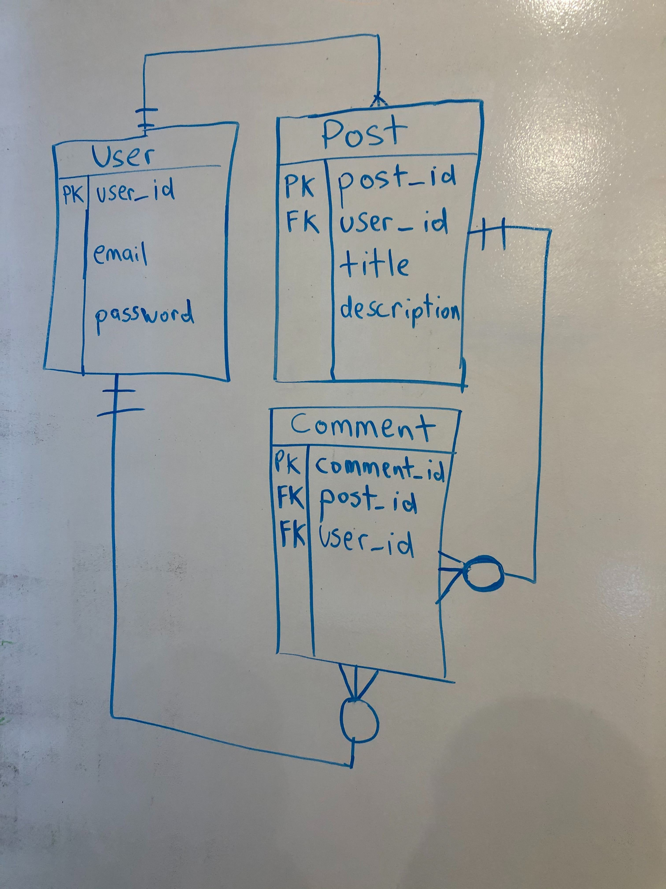

# ga-reddit-api-microservices
Reddit application using microservices architecture
        
## Table of contents

- [User Stories](#user-stories)
- [Timeline](#timeline)
- [Technologies](#Technologies-Used)
- [Approach](#General-Approach)
- [Hurdles](#Hurdles)
- [Dependencies](#Dependency-Instructions)
- [ERD](#erd)

## User-stories

[Pivotal Tracker](https://www.pivotaltracker.com/n/projects/2418961)

#timeline

1. Requirement Analysis
    * Friday(Nov 8, 2019) - User Stories & ERD
        
        We give our user stories points, so that we could prioritize our development steps. 
        
    * Monday(Nov 11, 2019) - Post and comment services.
        
        Began building posts and comments micro services with basic CRUD for each.
         
    * Tuesday(Nov 12, 2019) - User micro service.
    
         Built user micro service with basic CRUD.
            
    * Wednesday(Nov 13, 2019) - Began implementing API Gateway Security.
    
            Began adding UserJWT/Gateway security functionality on user service and api-gateway service respectively.
        
    * Thursday(Nov 14, 2019) - Continued implementing API Gateway Security.
    
            Finished implementation of Gateway Security and user JWT generation.
            
    * Friday(Nov 15, 2019) - Tested all route functionality.
    
            Added functionality between front end and back end services
    
            *-*-*-*-*-*-*

## Technologies-Used

    IntelliJ
    
    VSCode Live

    Docker
    
    Postgres
    
    Psql  

## General-Approach

    The general approach was to use our user stories to instruct us how to build each individual microservice.
    Our ERD told us how to build out our database. This differs in previous projects because we achieved this
    using microservices with Dcoker as opposed to a monoloithic approach.
    

## Hurdles

    The only unsolved problem left was the editing of user profile.
    It seems to be a CORS issue, but CORS issue was already solved before.

## Dependency-Instructions

    In order to install dependencies. Open this project with IntelliJ from the terminal via the 
    "idea ." command from each microservice directory. Go to pom.xml file for reach microservice and forever
    depencies have installed. If not you must enable auto-import here.
    

## ERD 
##### Rough Sketch of ERD.
